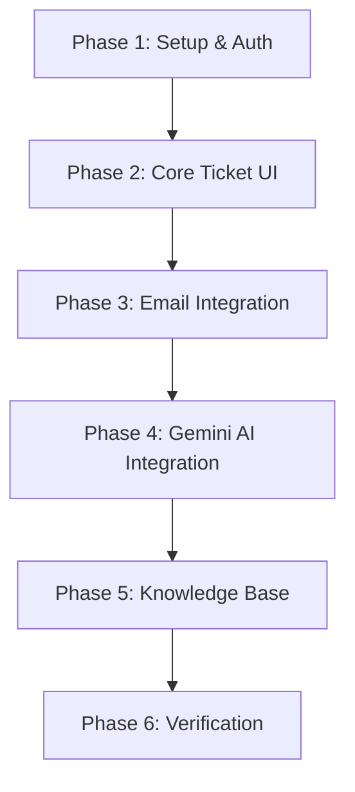

# AI-Powered Ticket Management System Implementation Plan

This implementation plan details the phases, database architecture, and specific task lists for building the AI-powered ticket management system using Laravel 12, Tailwind CSS, Alpine.js, Redis, and PostgreSQL.

## User Review Required

> [!IMPORTANT]
> The default implementation will start with:
> 1. An email-only interface for students (no student portal login; students receive/send emails, while only Admins and Agents log in).
> 2. A draft-and-approve AI workflow (AI drafts suggestions, but an Agent must review and click "Send").
> 3. Standard database text search for the Knowledge Base (with PGVector as an option if preferred).
> 
> Please review the open questions below to confirm if these align with your goals before approving this plan.

## Open Questions

> [!WARNING]
> Please review and confirm the following architectural details:
> 1. **AI Reply Automation**: Should the AI ever respond *fully autonomously* (sending an email directly to a student without human review) under high-confidence thresholds, or is a draft-and-approve workflow always required?
> 2. **Student Portal**: Do you want a login portal for students to see their tickets, or is their experience strictly email-based?
> 3. **Search Mechanism**: Do you prefer simple full-text database search for the Knowledge Base, or should we implement semantic search using the `pgvector` extension?
> 4. **Routing & Assignment**: When a new ticket is classified, should it be auto-assigned to an agent (e.g., round-robin or load-balanced) or remain in a shared pool for agents to claim?

---

## Proposed Phases & Task Breakdown

### Phase 1: Project Initialization & Auth Scaffold
Goal: Establish the base repository structure, authentication system, database migrations, and basic roles.

* **Tasks:**
  * Initialize the Laravel 12 project in the workspace.
  * Install **Laravel Breeze** and configure database-backed sessions.
  * Set up database migrations:
    * `users` (add `role` column: Admin, Agent).
    * `tickets` (id, subject, status, category, priority, student_email, student_name, assigned_agent_id).
    * `messages` (id, ticket_id, sender_type [student/agent/system], body, created_at).
    * `knowledge_base_articles` (id, title, content, tokens/embeddings).
  * Build Seeders for a default Admin account and sample ticket categories.
  * Implement Gates/Policies for role-based authorization (Admins vs. Agents).

---

### Phase 2: Core Ticket Dashboard & Management UI
Goal: Build the internal agent workspace to browse, filter, and reply to tickets.

* **Tasks:**
  * Build the Admin/Agent Dashboard shell with Tailwind CSS and responsive sidebar.
  * Implement the **Ticket List View**:
    * Filters by Status (`open`, `resolved`, `closed`), Category, Priority, and Assignee.
    * Sort by date created, last reply, or priority.
  * Implement the **Ticket Detail View**:
    * Render message thread chronologically.
    * Sidebar showing ticket metadata (status, category, priority, assigned agent) with inline editing forms.
    * Rich text area for agents to write replies.
  * Build the Admin User Management panel to allow Admins to invite/create Agent accounts.

---

### Phase 3: Postmark Email Integration
Goal: Enable outbound email notification replies and handle inbound student emails to automatically create/update tickets.

* **Tasks:**
  * Configure Laravel Mail to use Postmark for outgoing replies.
  * Create a secure Inbound Webhook endpoint (`/api/webhooks/inbound-email`) to receive payloads from Postmark.
  * Implement inbound parsing logic:
    * If sender email matches an open ticket (or uses headers indicating thread participation), append message to existing ticket.
    * If new thread, create a new ticket and record student details.
  * Set up local testing using **ngrok** to forward Postmark webhook notifications.

---

### Phase 4: Gemini AI Integration & Background Queues
Goal: Add AI-powered ticket analysis (classification, priorities, summaries, suggested replies) processed asynchronously.

* **Tasks:**
  * Set up Redis and Laravel Horizon to manage and monitor background jobs.
  * Install the Gemini PHP client library.
  * Create a background queue job `ProcessInboundTicketAI`:
    * Classify category (`general question`, `technical question`, `refund request`).
    * Detect priority (`low`, `medium`, `high`, `urgent`).
    * Generate a 1-2 sentence ticket summary.
  * Create a background job `GenerateAISuggestedReply` to draft a response using matching context from the Knowledge Base.
  * Render AI summary and AI-suggested replies on the Ticket Detail screen.

---

### Phase 5: Knowledge Base Management & Search
Goal: Provide an interface to manage help center documentation and feed it into the AI.

* **Tasks:**
  * Build Admin views for managing Knowledge Base articles (CRUD operations).
  * Implement semantic/full-text search logic:
    * Full-text indexing of articles for keyword matching.
    * (Optional) PGVector integration to compute article embeddings and perform cosine similarity search.
  * Hook search results into the Gemini AI system instructions to retrieve relevant contexts before generating suggested drafts.

---

### Phase 6: Testing & Verification
Goal: Ensure security, throughput, and error resilience.

* **Tasks:**
  * Write automated tests:
    * Webhook controller tests (mocking Postmark payload).
    * Authorization tests (ensuring agents cannot delete users or access unauthorized views).
    * Job execution tests (ensuring AI tasks run off the main thread).
  * Run end-to-end manual walkthrough tests from email submission to dashboard reply.
  * Build the final walkthrough.md report.

---

## Verification Plan

### Automated Tests
- Test suites: `php artisan test`
- Webhook simulation: `php artisan test --filter InboundEmailWebhookTest`

### Manual Verification
- Deploy local ngrok tunnel.
- Send test emails to the inbound address and verify ticket ingestion, auto-classification, and AI reply drafting.
- Verify status changes to `resolved` and `closed` correctly update email flows.
